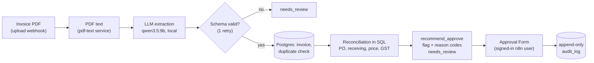
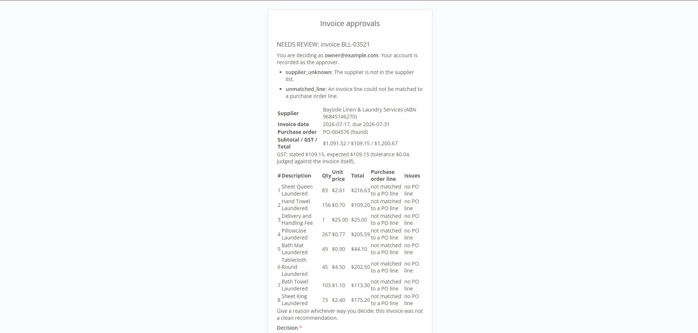
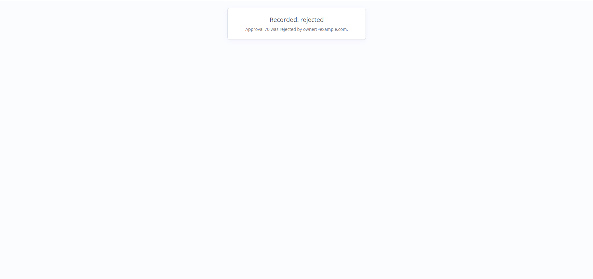

# hotel-ops-agent

Back-office automation for small and mid-sized hotels, built on self-hosted n8n. It
**reconciles supplier invoices against purchase orders and receiving records**, flags
discrepancies with reason codes, and routes every invoice through human approval with a full audit trail.

It is a portfolio project and a customer-discovery demo, so it aims for a correct, explainable,
measurable system rather than a long list of AI features. All data is synthetic.

## What it does



Everything in that picture is an n8n workflow (five of them, exported to `workflows/`) except the
database rules, which are SQL functions with their own tests. The model is used in exactly two places.

### Results

On fresh synthetic datasets nobody had examined, through the real webhook (not a re-implementation):

| What | Result |
|---|---|
| Extraction: total, invoice number, PO number | **100%** each (196/196) |
| Extraction: line items, strict (description, quantity, unit price, line total) | **99.2%** (892/899) |
| Reconciliation: `flag` recall, end to end from the PDFs | **100%** (71/71) |
| Reconciliation: `flag` precision | **98.6%** (71/72) |
| Truly flagged invoices that were approved | **0** |

Failed and discarded runs are kept on record too (see [P2](#p2-result) for a first run that *missed* a target and why).
These numbers show the system works as specified on synthetic data, not that the rules suit a real hotel.

### The approval step

| The decision page | The result |
|---|---|
|  |  |

A [dashboard snapshot](docs/dashboard.html) (`python evals/dashboard.py`) summarises what the system has done.

### Where I deliberately did not use an LLM

The model reads the invoice text and, only when a line has no SKU match, proposes a match with a
confidence that must clear 0.85. Everything else is plain code or SQL, because it has to be exact and explainable:
totals and GST arithmetic, PO matching, quantity against receiving, price tolerance, duplicate detection,
idempotency keys, approval rules, and the decision to approve (a person). In the gate run, every discrepancy
between the system and the labels traced to the model's *extraction*, not to the rules, which is the argument for
keeping the model's job small and validating what it returns.

### Design rules

- **Deterministic first, LLM last.**
- **Every LLM output is schema-validated**, retried once, then sent to `needs_review`.
- **No side effects without a human.** Auto-approve is only a recommendation.
- **Idempotent ingestion**, **workflows as code**, **synthetic data only**.
- **Infrastructure faults are not verdicts**: a down model server fails the run loudly instead of marking an invoice bad.

## Status

| Phase | Scope | Status |
|---|---|---|
| P0 | Compose stack, migrations, import/export scripts, CI | done, gate confirmed |
| P1 | Synthetic data: 200 labelled invoices | done, gate confirmed |
| P2 | Invoice ingestion: webhook, extraction, validation, database | done, gate confirmed |
| P3 | Reconciliation: deterministic rules, model-assisted line matching | done, gate confirmed |
| P4 | Human approval and audit trail | done, gate confirmed |
| P5 | Ops inbox triage (stretch) | **not built, by choice**: it needs its own workflow, eval and approval path, and adds nothing to the core claim |
| P6 | Observability and write-up | trimmed: README, [dashboard](docs/dashboard.html) over the audit and approval tables. **Per-call token and cost logging is not built**: it would mean reworking the extraction workflow, and it is irrelevant for a local model with no per-token price |

### P2 result

Through the real workflow on a fresh 200-invoice dataset (196 scored), with `qwen3.5:9b` on a laptop GPU:

| Target | Result |
|---|---|
| total ≥ 98% | **100%** (196/196) |
| invoice number ≥ 98% | **100%** (196/196) |
| PO number ≥ 98% | **100%** (196/196) |
| line items ≥ 90% (strict: description, quantity, unit price and line total all correct) | **99.2%** (892/899) |

Every duplicate was linked to its original and every re-sent file was a no-op. About 14 seconds per
invoice. A first run on a different dataset *missed* the line-item target (86.8%); the cause was n8n's
own PDF text extractor, found and fixed, and the final number was taken on data nobody had examined.
Both reports and the story are in [`evals/results/`](evals/results/README.md). Synthetic invoices
only; see the [known limitations](docs/architecture.md#known-limitations).

### P3 result

Reconciliation, end to end from the PDFs through the real workflow on a fresh 200-invoice dataset
(196 reconciled), with `qwen3.5:9b`, taken once with nothing tuned afterwards:

| Measure | Result |
|---|---|
| `flag` recall (truly flagged invoices that were flagged) | **100%** (71/71), 95% CI 94.9 to 100% |
| `flag` precision (flagged invoices that truly had a discrepancy) | **98.6%** (71/72) |
| Truly flagged invoices that were approved | **0** |
| Exact reason-code set correct | 192 of 196 |

Per discrepancy type, recall is 100% for all six (`price_variance` 20, `short_delivery` 16,
`duplicate_invoice` 12, `unknown_po` 8, `missing_po` 6, `gst_miscalculated` 14 invoices); precision is 100%
for `duplicate_invoice`, `unknown_po` and `missing_po`, 90.9% `price_variance`, 88.9% `short_delivery`,
87.5% `gst_miscalculated`.

Five invoices differ from their labels, and **every one traces to the model's extraction**, not to the
rules or to line matching: item codes shifted up a row (the reconciler trusted them, so a clean invoice was
falsely flagged), a dropped line (caught by the totals check and sent to a human), and wrong per-line GST
markers on invoices without a PO. The model's own line matching was right on all 46 lines it was asked about.
The synthetic labels and the reconciler share rules, so these numbers show the system works as specified on
this data, not that the rules suit a real hotel. Reports and the per-invoice analysis:
[`evals/results/`](evals/results/README.md), [`docs/p3-engineering-log.md`](docs/p3-engineering-log.md).

### P4: human approval

Every reconciled invoice gets an approval request. A person signs in to n8n, reviews the invoice next to its
purchase order and the reasons for the recommendation, and approves or rejects it; the decision, **the signed-in
account as approver** and the time go to the append-only `audit_log`. A decision is final, approving a flagged or
doubtful invoice (or rejecting any) needs a written reason, and nothing is approved, paid or sent without this
step. See [how it works](docs/architecture.md#human-approval-p4) and
[`docs/p4-engineering-log.md`](docs/p4-engineering-log.md) for what went wrong on the way.

```bash
bash scripts/setup-owner.sh                  # once: the n8n account approvers sign in with (from .env)
set -a; . ./.env; set +a
python evals/demo.py                         # invoice -> reconciliation -> approval request -> you decide in the browser
python evals/demo.py --decide approve --comment "Supplier agreed the price by phone."   # or the script decides
```

Open `http://localhost:5678/form/6f0a3c1e-7a52-4b6e-9d0f-2f4c1d5a8b01` for the list of pending approvals.
Use the address in `N8N_WEBHOOK_URL` (in `.env`) every time, for the editor and the form alike: n8n builds its
sign-in redirects from that setting, and `localhost` and `127.0.0.1` are different hosts to a browser's cookies.
It was tested with a scripted client and then used in a real browser (sign-in, list, decision, result all worked);
screenshots and what they led to are in [`docs/p4-engineering-log.md`](docs/p4-engineering-log.md#8-the-first-real-browser-run-by-the-user-2026-10-09).
The demo picks invoices from `data-gen/out`, so load that dataset's master data first
(`bash scripts/reset-ops-data.sh && bash scripts/seed.sh`); it stops and says so if the database holds another.

## Documentation

| Read | For |
|---|---|
| [docs/architecture.md](docs/architecture.md) | components, data model, the ingestion and reconciliation workflows with their rules and failure semantics, what is built versus planned, known limits |
| [docs/decisions.md](docs/decisions.md) | every design decision with its reason, newest last |
| [docs/p6-engineering-log.md](docs/p6-engineering-log.md) | what P6 delivered and what was dropped on purpose |
| [docs/p4-engineering-log.md](docs/p4-engineering-log.md) | the same for P4, including the form spike, what an open form session leaves behind, and the tests that turned out to be vacuous |
| [docs/p3-engineering-log.md](docs/p3-engineering-log.md) | the same for P3: every run, bug and mistake, how each failure is handled, and what is unverified |
| [docs/p2-engineering-log.md](docs/p2-engineering-log.md) | the history behind P2: every model run (including discarded ones), every bug with cause and fix, mistakes made, how each failure is handled, and what is still unverified |
| [docs/prompts.md](docs/prompts.md) | LLM prompts, mirrored from `prompts/` so changes diff cleanly |
| [data-gen/README.md](data-gen/README.md) | synthetic data and the ground-truth format |
| [docs/synthetic-data-report.md](docs/synthetic-data-report.md) | label distribution of the 200-invoice dataset |
| [evals/README.md](evals/README.md) | how extraction and the pipeline are measured, protocol and metrics |

## Quickstart

Requires Docker with Compose v2, bash (Git Bash works on Windows), and for the model side
[Ollama](https://ollama.com) on the host with a model pulled (`ollama pull qwen3.5:9b`).

```bash
bash scripts/init-env.sh            # .env with generated secrets (or: cp .env.example .env)
docker compose up -d --wait         # postgres -> migrations -> pdf-text (built) -> n8n
bash scripts/setup-credentials.sh   # n8n credentials from .env (never exported to git)
bash scripts/import.sh              # load and publish the workflows
bash scripts/setup-owner.sh         # the n8n account approvers sign in with (needed for the Approval Form)
```

n8n: http://localhost:5678 (sign in with `N8N_OWNER_EMAIL` and `N8N_OWNER_PASSWORD` from `.env`). Postgres (host):
`localhost:5433`, databases `n8n` and `ops`.

### Try it

```bash
python -m pip install -r requirements-dev.txt        # Python 3.12
python data-gen/generate.py --n 200 --seed 42        # synthetic PDFs + ground truth -> data-gen/out/
bash scripts/seed.sh                                 # suppliers, POs, receipts -> ops database

set -a; . ./.env; set +a
curl -s -X POST -H "X-Ingest-Token: $INGEST_WEBHOOK_TOKEN" \
     -F "file=@data-gen/out/invoices/inv_0001.pdf" http://127.0.0.1:5678/webhook/invoice-upload
```

The reply says what happened: `extracted` (with the invoice id and the extracted fields),
`noop` (this exact file was already processed), or `needs_review` (the model's output failed
validation twice, or there was no text to read). Uploading a *different* file of the same invoice
stores it with `duplicate_of` set. See [the failure table](docs/architecture.md#what-each-outcome-means)
for every case, including what happens when the model server is down.

After an invoice is stored, the same response carries its **reconciliation**: `recommend_approve`,
`flag` with reason codes (`price_variance`, `short_delivery`, `duplicate_invoice`, `unknown_po`,
`missing_po`, `gst_miscalculated`) or `needs_review` with review reasons. Re-run or complete one with:

```bash
curl -s -X POST -H "X-Ingest-Token: $INGEST_WEBHOOK_TOKEN" -H "Content-Type: application/json" \
     -d '{"invoice_id": 1}' http://127.0.0.1:5678/webhook/reconcile
```

The rules and what each outcome means are in [docs/architecture.md](docs/architecture.md#reconciliation-p3).

Output of `data-gen` is deterministic: the same `(n, seed)` gives byte-identical files.

### Measure it

```bash
bash scripts/reset-ingestion.sh                                     # clean slate
python evals/run.py --suite extraction --target n8n                 # the gate run, through the webhook
python evals/run.py --suite reconciliation                          # rules only, SQL only, no model
python evals/run.py --suite reconciliation --source pdf             # end to end from the PDFs (the number that counts)
```

See [evals/README.md](evals/README.md) for the dev-set versus gate-set protocol and for testing
the pipeline without a GPU (a mock model; reports made with it are stamped as such).

An alternative to native Ollama is `docker compose --profile local-llm up -d` (host port 11435;
set `OLLAMA_BASE_URL=http://ollama:11434` and rerun `setup-credentials.sh`). GPU passthrough
through Docker is untested here.

## Working on workflows

The n8n UI is an editor; `workflows/` is the source of truth.

```bash
bash scripts/export.sh   # after editing in the UI: export, strip pinData, normalise
```

`export.sh` replaces `workflows/` with exactly what is in n8n, so deletions and renames show up
in `git diff`. On a fresh instance, import before you export. Exports drop `pinData`,
`staticData` and volatile metadata, and a re-export of unchanged workflows is byte-identical.
`import.sh` publishes the workflows marked active and restarts n8n to register the webhook.

## Database migrations

Plain SQL in `db/migrations/NNN_name.sql`, applied in order by the `migrate` service on every
`docker compose up`, each once, each in its own transaction. Never edit an applied migration
(its checksum is verified and a mismatch aborts); add a new one. Re-run manually with
`docker compose run --rm migrate`. SQL tests: `bash scripts/test-db.sh`. Starting over:
`docker compose down -v`.

## Tests

```bash
pytest          # data-gen and evals; no GPU, Ollama or Docker needed (workflow-code tests need Node)
bash scripts/test-db.sh
ruff check . && ruff format --check .
```

The tests cover the generator and its labels (an independent oracle re-derives every label from
the written files, across 30 seeds), the extraction schema, the scorer, the validate-retry
contract with a fake model, the workflow's own JavaScript run under Node against the Python
(thousands of generated and mutated outputs, for both the extraction and the line-matching nodes), the
reconciliation scorer, the approval form's page code (including that hostile text is shown, never run), the mock model, and that `docs/prompts.md` matches
`prompts/`. CI also boots the stack and exercises the whole ingestion pipeline; see
[docs/architecture.md](docs/architecture.md#ci).

## Layout

```
docker-compose.yml   n8n + postgres + migrate (+ ollama profile)
db/init/             first-start role and database creation
db/migrations/       numbered SQL migrations for the ops database
db/tests/            SQL tests
data-gen/            synthetic data generator, ground truth, tests
services/pdf-text/   PDF text extraction service (pypdf), shared by the workflow and the evals
evals/               eval harness, mock model, pipeline checks, dashboard, tests, reports
prompts/             LLM prompts (mirrored in docs/prompts.md)
schemas/             JSON schemas for LLM outputs
workflows/           exported n8n workflows, one file per workflow
scripts/             init-env, setup-credentials, setup-owner, import, export, migrate, seed, test-db,
                     reset-ingestion, reset-ops-data, check_workflows
docs/                architecture, decisions log, prompts, reports
```
