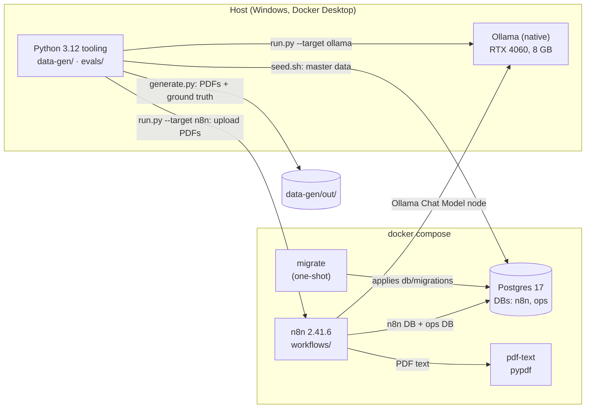
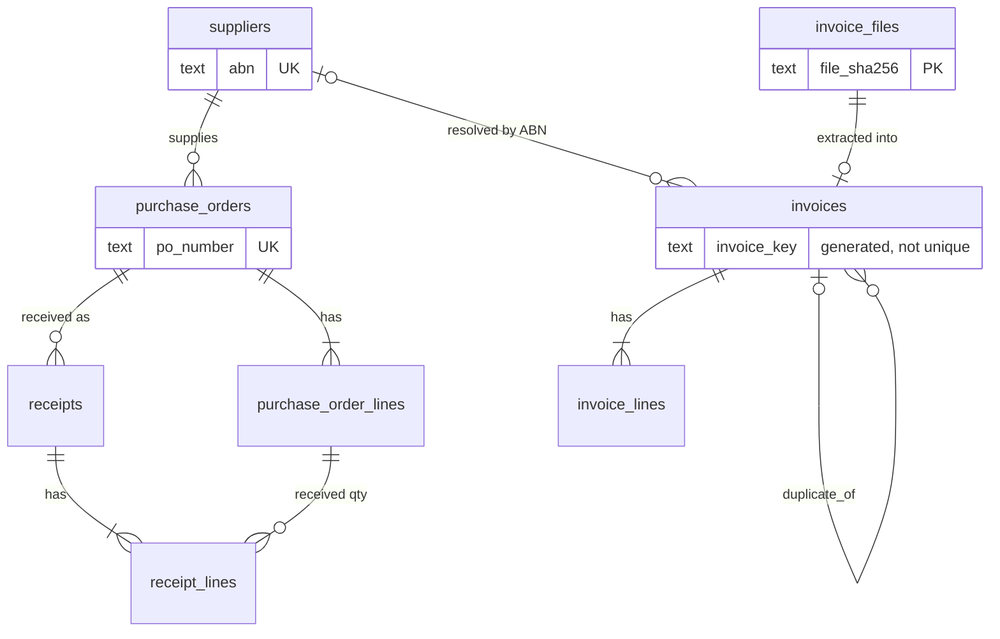
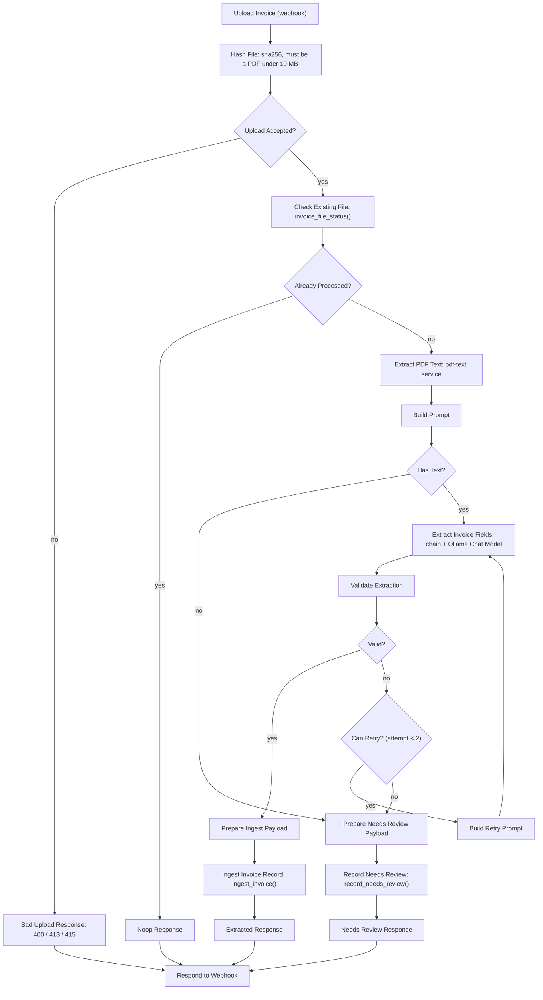

# Architecture

How the system fits together, what is built today, and what is planned. Decisions and their
reasons are in [decisions.md](decisions.md), the bug and run history in
[p2-engineering-log.md](p2-engineering-log.md); this page is the map.

**Status legend:** built and tested = ✅ · in progress = 🔧 · planned = ⏳

| Phase | Scope | Status |
|---|---|---|
| P0 | Compose stack, migrations runner, import/export scripts, CI | ✅ |
| P1 | Synthetic suppliers, POs, receipts, invoice PDFs, ground truth | ✅ |
| P2 | Invoice ingestion: database, extraction schema and prompt, n8n workflow, PDF text service, eval harness ✅; gate targets met, awaiting confirmation | ✅ |
| P3 | Deterministic reconciliation + fuzzy line matching | ⏳ |
| P4 | Human approval (send-and-wait / form), audit trail, error notifications | ⏳ |
| P5 | Ops inbox triage (stretch) | ⏳ |
| P6 | Observability, dashboard, write-up | ⏳ |

---

## Principles that shape the design

1. **Deterministic first, LLM last.** The model transcribes text from an invoice into a
   schema, and (in P3) breaks ties when a line has no SKU match. Arithmetic, GST checks, PO
   matching, tolerances and duplicate detection are SQL or plain code.
2. **Every LLM output is schema-validated** before it goes anywhere. One retry with the
   validation errors appended; a second failure goes to `needs_review`.
3. **No side effects without approval.** Auto-approve is only a recommendation status.
4. **Idempotent ingestion.** The same file twice does nothing; a re-issued invoice (same key,
   different file) is stored and flagged, not silently dropped.
5. **Workflows are code.** `workflows/*.json` is the source of truth; the n8n UI is an editor.
6. **Synthetic data only.** Nothing from a real operator ever enters the repo.

### Where the LLM is and is not used

| Job | Done by | Why |
|---|---|---|
| Read an invoice PDF's text layer | code (`pdf-text` service, pypdf) | deterministic, free, and the same text the eval sees |
| Turn that text into structured fields | **LLM**, schema-validated | layouts vary across suppliers |
| Schema, calendar-date, ABN-checksum and quantity-precision checks | code (`Validate Extraction`) | a schema cannot express them |
| Dollar strings to integer cents, ABN digits, supplier lookup | Postgres (`ingest_invoice()`) | arithmetic and lookups |
| Invoice idempotency key, duplicate detection | Postgres (`invoice_key_of()`, `ingest_invoice()`) | one definition, tested |
| Totals, GST, tolerance, PO and receipt matching | SQL / code (P3) | must be exact and explainable |
| Match a line to a PO line when no SKU matches | **LLM** with thresholded confidence (P3) | genuinely fuzzy |
| Approve, pay, send | a human (P4) | principle 3 |

---

## Components

- **`docker-compose.yml`**: `postgres` (17.11), `migrate` (runs `db/migrations/*.sql` then
  exits), `n8n` (2.41.6, waits for `migrate`), optional `ollama` behind the `local-llm`
  profile. Everything binds to `127.0.0.1`. Images are pinned to exact tags. `prompts/` and
  `schemas/` are mounted read-only into the n8n container so the workflow reads the very files
  the eval harness reads.
- **`pdf-text`** (`services/pdf-text`): a 60-line HTTP service around `pypdf`, on the internal compose
  network only. It exists because n8n's `Extract From File` space-joins every cell of a table row,
  which cost about 9 points of line-item accuracy; pypdf puts one cell per line. The eval harness
  imports the service's own `extract_text`, and a test checks the pypdf pins match, so the model sees
  the same text in evals and in production.
- **Ollama**: the native Windows install on port 11434, reached from n8n as
  `http://host.docker.internal:11434` (`extra_hosts` makes that name work on Linux too). The
  compose profile (host port 11435) remains for machines without a native install; GPU
  passthrough through Docker is untested.
- **Code node sandbox**: `NODE_FUNCTION_ALLOW_BUILTIN=crypto,fs` and no external modules.
  The sandbox also forbids code generation, which is why validation is an interpreter, not ajv
  (see below).
- **Credentials** are never in git. `scripts/setup-credentials.sh` creates three from `.env`
  with fixed ids (`Ops Postgres`, `Ollama`, `Ingest Webhook Token`); workflows reference them
  by id and name only.

### Databases

One Postgres instance, two databases, one role each. `n8n` holds n8n's internals. `ops` holds
application data and is owned by `ops_app`, the role n8n's Postgres credential uses for app
data, so n8n's own tables and the app's tables cannot be touched through each other's
credentials.

---

## Data model (`ops` database)

Money is integer cents ex GST. Quantities are `numeric(12,3)`.

| Migration | Contents | Notes |
|---|---|---|
| `001_audit_log` | `audit_log` | append-only: triggers reject UPDATE, DELETE and TRUNCATE |
| `002_procurement` | `suppliers`, `purchase_orders`, `purchase_order_lines`, `receipts`, `receipt_lines`, `seed_metadata` | master data; `seed_metadata` guards against loading a different dataset on top |
| `003_invoices` | `invoice_files`, `invoices`, `invoice_lines`, `invoice_key_of()` | see below |
| `004_ingest_functions` | `dollars_to_cents()`, `ingest_invoice()`, `record_needs_review()`, `invoice_file_status()` | the ingestion logic; fixes `unit` nullable and `attempts` 0 to 2 |

Planned: `reconciliations` and per-line results (P3), approvals use `audit_log` (P4),
`llm_calls` (P6). Database tests live in `db/tests/*.sql` (plain `ASSERT`s in a rolled-back
transaction; run with `bash scripts/test-db.sh`).

### Idempotency and duplicates

Two different questions, answered by two different keys:

| Question | Key | Outcome |
|---|---|---|
| Have I already processed these exact bytes? | `invoice_files.file_sha256` (primary key) | no-op: nothing changes and the model is not called; also remembers files that failed extraction, so a failed file is not silently retried |
| Is this the same invoice as one I already have? | `invoices.invoice_key` = `sha256(abn \| UPPER(TRIM(invoice_number)) \| total_cents)` | stored with `duplicate_of` pointing at the first (never at another duplicate); reconciliation flags `duplicate_invoice` |

`invoice_key` is a generated column calling `invoice_key_of()`, so there is one definition in
the system. A test and a CI step check it against the Python version of the same function. A
single key as the only guard would silently drop re-issued invoices and make the
`duplicate_invoice` flag unreachable.

---

## Invoice ingestion (P2)

### Contract with the model

- **Prompts:** [`prompts/invoice_extraction.md`](../prompts/invoice_extraction.md) and
  [`prompts/invoice_extraction_retry.md`](../prompts/invoice_extraction_retry.md), mirrored in
  [prompts.md](prompts.md) (a test fails if they drift).
- **Output schema:** [`schemas/invoice_extraction.json`](../schemas/invoice_extraction.json)
  (JSON Schema 2020-12). It transcribes what is printed: money as dollar strings like
  `"1430.74"`, dates as `YYYY-MM-DD`, `null` where a thing is not printed (PO number, unit,
  per-line GST, supplier code). The model is told never to recalculate or "fix" a figure, so a
  wrong GST total is extracted faithfully and caught later by deterministic checks.
- **Not extracted:** supplier address, email, phone (reconciliation does not use them).
- **Not supported:** credit notes (negative amounts) and scanned PDFs without a text layer;
  both end in `needs_review`. Money is limited to 12 integer digits and quantities to 3
  decimals, the limits of what the database stores.

### The `Ingest Invoice` workflow

`POST /webhook/invoice-upload`, multipart field `file`, header `X-Ingest-Token`.

Node names are API (expressions reference them), so a rename means grepping the workflow JSON.
The `Error Handler` workflow is set as the error workflow; it writes `workflow.error` rows to
`audit_log` (failing node and message, never item data). It must be published to run.

### What each outcome means

| Situation | HTTP | Recorded? | Re-upload |
|---|---|---|---|
| New invoice, valid | 200 `extracted` | yes: file, invoice, lines, audit row | no-op |
| Same invoice, different file | 200 `extracted`, `duplicate_of` set | yes, linked to the original | no-op |
| Same bytes | 200 `noop` | nothing changes; model not called | no-op |
| Model output invalid twice | 200 `needs_review` | file + the model's last output + reason | no-op: never silently reprocessed |
| No text layer (scan) | 200 `needs_review`, 0 attempts | file + reason | no-op |
| PDF the extractor cannot read (corrupt, encrypted) | 200 `needs_review`, 0 attempts | file + the extractor's error | no-op |
| Not a PDF / too big / no file | 415 / 413 / 400 | no | n/a |
| Wrong or missing token | 403 | no | n/a |
| Model server down (refused, timeout, 5xx) | 5xx | **no**, only an audit row | **works** once the server is back |
| `pdf-text` service down | 5xx | **no**, only an audit row | **works** once it is back |

The two outage rows are deliberate: an outage must not permanently poison every file that arrived
during it. Only the model's own unparseable output, or a PDF that genuinely cannot be read, counts
as `needs_review`.

### Validation in n8n

The Code node sandbox forbids code generation, so ajv cannot compile a schema there. `Validate
Extraction` is a small interpreter over `schemas/invoice_extraction.json` that supports exactly
the keywords our schemas use and **throws on any other**, so a schema change cannot be silently
ignored. It then applies what a schema cannot express: real calendar dates (not before 1900),
the ABN checksum, and at most 3 decimals on quantities. `evals/tests/test_workflow_code.py`
runs this node's real code under Node against the Python validator on thousands of generated
and mutated outputs and requires identical verdicts.

### Provider and model

The workflow reaches the model through n8n's Ollama Chat Model node, so changing provider is a
credential and node change. That node requests generic JSON mode, not schema-constrained
decoding; the eval measured both and they gave identical output (see
[evals/README.md](../evals/README.md) and the decisions log). The model is fixed by the node's
`model` parameter in the workflow JSON, so changing it is a reviewed diff.

---

## Evaluation

[`evals/`](../evals/README.md) scores extraction against the ground truth `data-gen` writes next
to every PDF. Targets for the P2 gate: total, invoice number and PO number ≥ 98%; line items
≥ 90% (a line counts only if description, quantity, unit price and line total all match). The
gate run goes through the real workflow (`run.py --target n8n`), so it measures what
production runs, including n8n's PDF text extraction, not just the model. It also checks
ingestion behaviour (duplicates linked, re-sends no-ops) separately from extraction accuracy.

Gate runs, in order (reports in [`evals/results/`](../evals/results/)): run 1 on seed 42 with n8n's
own text extractor missed the line-item target (86.8%); the cause was found by comparing text
sources on identical dev invoices, fixed with the `pdf-text` service, and the final number was taken
on a fresh dataset (seed 43) that had never been examined. See the decisions log for the reasoning.

Two kinds of test, deliberately kept apart:

- **Accuracy** needs a real model and a GPU: `run.py`, run by hand, never in CI.
- **Pipeline behaviour** needs no GPU: `pipeline_check.py` and `run.py --mock` use a mock
  model (`evals/mock_ollama.py`) that answers from ground truth. They prove the retry,
  `needs_review`, outage, idempotency and database behaviour, and say nothing about accuracy.
  Reports from the mock are stamped as such and written to a separate file.

---

## Synthetic data

[`data-gen/`](../data-gen/README.md) produces 12 fictional suppliers, POs, receipts and invoice
PDFs in four deliberately different layouts, with injected discrepancies at known rates (price
variance, short delivery, duplicate, unknown/missing PO, GST miscalculation), plus labelled
conditions that must **not** flag (differently-worded lines, partial deliveries, price
differences within tolerance, byte-identical re-sends). Output is deterministic for a given
`(n, seed)`. The label distribution is in
[synthetic-data-report.md](synthetic-data-report.md).

---

## CI

GitHub Actions on every push and pull request (`.github/workflows/ci.yml`):

| Job | What it enforces |
|---|---|
| Workflow JSON checks | valid JSON, no non-empty `pinData`, credential references carry only id and name |
| Secret scan | gitleaks (pinned image, `.gitleaks.toml` allowlists one public test vector) over full history |
| ruff + pytest | lint, format, and the data-gen and evals tests on Python 3.12, including the workflow's JS under Node |
| Stack and ingestion pipeline | stack boots (including building the `pdf-text` image); migrations apply and re-run as a no-op; Postgres `invoice_key_of()` matches Python; `db/tests` pass; seed loads twice identically; credentials, import and publish work and are idempotent; the pipeline behaviour checks pass against the mock model; 100 invoices ingest through the webhook with every duplicate and re-send handled correctly; export round-trips byte for byte |

Evals that call a real model are never run in CI; they are run by hand.

---

## Known limitations

- **Synthetic data only.** Layouts are four templates; real supplier invoices vary far more.
  The accuracy numbers say the pipeline works on this distribution, not that it is
  production-ready.
- **One local model class.** Ollama only, on an 8 GB GPU, at a 4096-token context. The
  Anthropic comparison is out of P2 scope.
- **One dataset for the gate.** One seed and 196 scored invoices: a 98% target allows 3
  misses, so reports include 95% confidence intervals.
- **Token and cost visibility.** Not available through the workflow yet; `ops.llm_calls`
  arrives in P6.
- **Notifications.** The Error Handler records to `audit_log` only; the notification half
  arrives in P4 with the approval channel.
- **Windows dev environment.** Scripts run under Git Bash and containers; CI runs on Linux.
