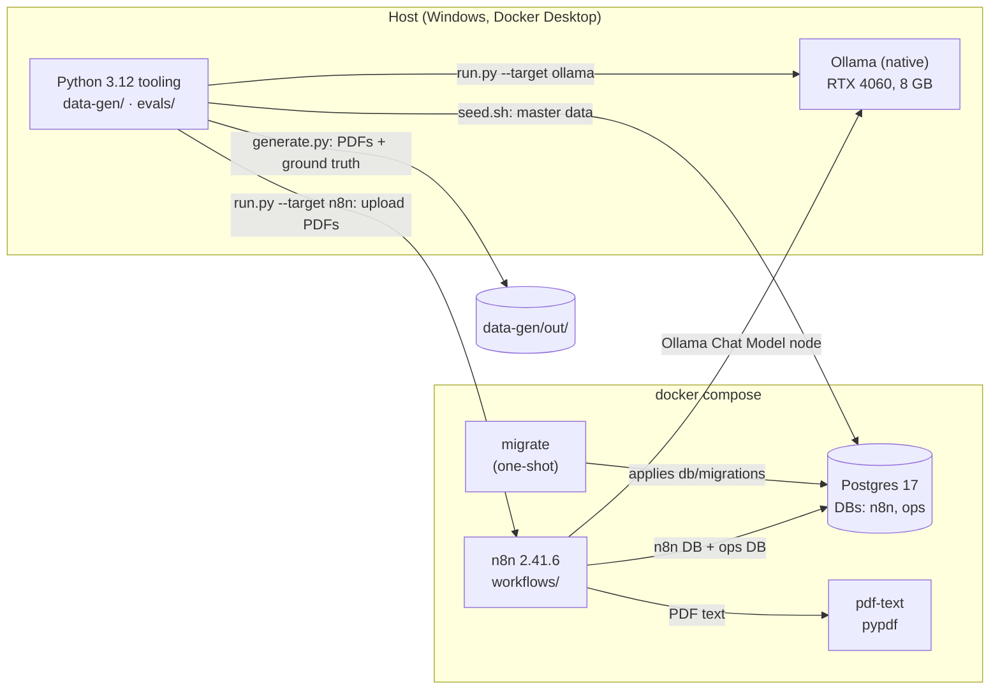
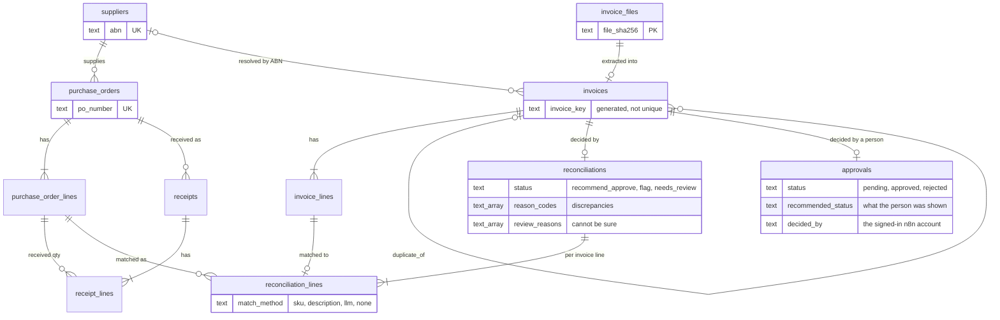
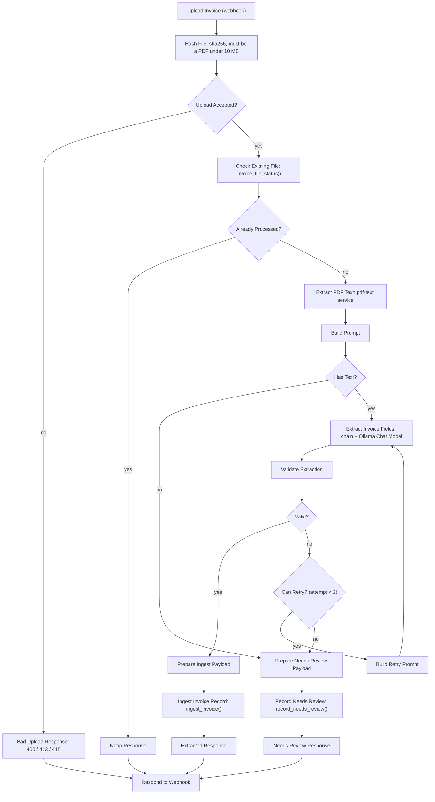
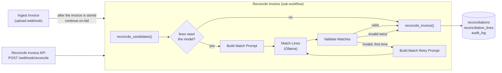
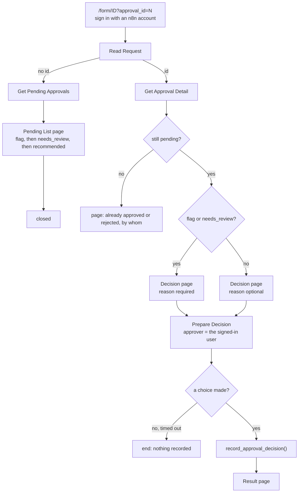

# Architecture

How the system fits together, what is built today, and what is planned. The bug and run
history, with the reasons behind each decision, is in the engineering logs
([p2](p2-engineering-log.md), [p3](p3-engineering-log.md), [p4](p4-engineering-log.md)); this page is the map.

**Status legend:** built and tested = ✅ · in progress = 🔧 · planned = ⏳

| Phase | Scope | Status |
|---|---|---|
| P0 | Compose stack, migrations runner, import/export scripts, CI | ✅ |
| P1 | Synthetic suppliers, POs, receipts, invoice PDFs, ground truth | ✅ |
| P2 | Invoice ingestion: database, extraction schema and prompt, n8n workflow, PDF text service, eval harness ✅; gate targets met, awaiting confirmation | ✅ |
| P3 | Deterministic reconciliation + fuzzy line matching | ⏳ |
| P4 | Human approval (send-and-wait / form), audit trail, error notifications | ⏳ |
| P5 | Ops inbox triage (stretch) | ⏳ |
| P6 | Observability, dashboard, write-up | ⏳ |

---

## Principles that shape the design

1. **Deterministic first, LLM last.** The model transcribes text from an invoice into a
   schema, and (in P3) breaks ties when a line has no SKU match. Arithmetic, GST checks, PO
   matching, tolerances and duplicate detection are SQL or plain code.
2. **Every LLM output is schema-validated** before it goes anywhere. One retry with the
   validation errors appended; a second failure goes to `needs_review`.
3. **No side effects without approval.** Auto-approve is only a recommendation status.
4. **Idempotent ingestion.** The same file twice does nothing; a re-issued invoice (same key,
   different file) is stored and flagged, not silently dropped.
5. **Workflows are code.** `workflows/*.json` is the source of truth; the n8n UI is an editor.
6. **Synthetic data only.** Nothing from a real operator ever enters the repo.

### Where the LLM is and is not used

| Job | Done by | Why |
|---|---|---|
| Read an invoice PDF's text layer | code (`pdf-text` service, pypdf) | deterministic, free, and the same text the eval sees |
| Turn that text into structured fields | **LLM**, schema-validated | layouts vary across suppliers |
| Schema, calendar-date, ABN-checksum and quantity-precision checks | code (`Validate Extraction`) | a schema cannot express them |
| Dollar strings to integer cents, ABN digits, supplier lookup | Postgres (`ingest_invoice()`) | arithmetic and lookups |
| Invoice idempotency key, duplicate detection | Postgres (`invoice_key_of()`, `ingest_invoice()`) | one definition, tested |
| Totals, GST, tolerance, PO and receipt matching | SQL / code (P3) | must be exact and explainable |
| Match a line to a PO line when no SKU matches | **LLM** with thresholded confidence (P3) | genuinely fuzzy |
| Approve, pay, send | a human (P4) | principle 3 |

---

## Components

- **`docker-compose.yml`**: `postgres` (17.11), `migrate` (runs `db/migrations/*.sql` then
  exits), `n8n` (2.41.6, waits for `migrate`), optional `ollama` behind the `local-llm`
  profile. Everything binds to `127.0.0.1`. Images are pinned to exact tags. `prompts/` and
  `schemas/` are mounted read-only into the n8n container so the workflow reads the very files
  the eval harness reads.
- **`pdf-text`** (`services/pdf-text`): a 60-line HTTP service around `pypdf`, on the internal compose
  network only. It exists because n8n's `Extract From File` space-joins every cell of a table row,
  which cost about 9 points of line-item accuracy; pypdf puts one cell per line. The eval harness
  imports the service's own `extract_text`, and a test checks the pypdf pins match, so the model sees
  the same text in evals and in production.
- **Ollama**: the native Windows install on port 11434, reached from n8n as
  `http://host.docker.internal:11434` (`extra_hosts` makes that name work on Linux too). The
  compose profile (host port 11435) remains for machines without a native install; GPU
  passthrough through Docker is untested.
- **Code node sandbox**: `NODE_FUNCTION_ALLOW_BUILTIN=crypto,fs` and no external modules.
  The sandbox also forbids code generation, which is why validation is an interpreter, not ajv
  (see below).
- **Credentials** are never in git. `scripts/setup-credentials.sh` creates three from `.env`
  with fixed ids (`Ops Postgres`, `Ollama`, `Ingest Webhook Token`); workflows reference them
  by id and name only.

### Databases

One Postgres instance, two databases, one role each. `n8n` holds n8n's internals. `ops` holds
application data and is owned by `ops_app`, the role n8n's Postgres credential uses for app
data, so n8n's own tables and the app's tables cannot be touched through each other's
credentials.

---

## Data model (`ops` database)

Money is integer cents ex GST. Quantities are `numeric(12,3)`.

| Migration | Contents | Notes |
|---|---|---|
| `001_audit_log` | `audit_log` | append-only: triggers reject UPDATE, DELETE and TRUNCATE |
| `002_procurement` | `suppliers`, `purchase_orders`, `purchase_order_lines`, `receipts`, `receipt_lines`, `seed_metadata` | master data; `seed_metadata` guards against loading a different dataset on top |
| `003_invoices` | `invoice_files`, `invoices`, `invoice_lines`, `invoice_key_of()` | see below |
| `004_ingest_functions` | `dollars_to_cents()`, `ingest_invoice()`, `record_needs_review()`, `invoice_file_status()` | the ingestion logic; fixes `unit` nullable and `attempts` 0 to 2 |
| `005_column_comments` | comments only | says in the schema which extracted columns are unreliable |
| `006_reconciliation` | `reconciliation_settings`, `reconciliations`, `reconciliation_lines`, `reconciliation_setting()`, `po_key()`, `description_key()`, `deterministic_line_matches()`, `reconcile_candidates()`, `reconcile_invoice()` | the reconciliation rules; see [Reconciliation (P3)](#reconciliation-p3) |

| `007_approvals` | `approvals`, `approval_trim()`, `request_approval()`, `record_approval_decision()`, `pending_approvals()`, `approval_detail()`, `invoice_audit_trail()` | human approval; see [Human approval (P4)](#human-approval-p4) |

Planned: `llm_calls` (P6). Database tests live in `db/tests/*.sql` (plain `ASSERT`s in a rolled-back
transaction; run with `bash scripts/test-db.sh`).

### Idempotency and duplicates

Two different questions, answered by two different keys:

| Question | Key | Outcome |
|---|---|---|
| Have I already processed these exact bytes? | `invoice_files.file_sha256` (primary key) | no-op: nothing changes and the model is not called; also remembers files that failed extraction, so a failed file is not silently retried |
| Is this the same invoice as one I already have? | `invoices.invoice_key` = `sha256(abn \| UPPER(TRIM(invoice_number)) \| total_cents)` | stored with `duplicate_of` pointing at the first (never at another duplicate); reconciliation flags `duplicate_invoice` |

`invoice_key` is a generated column calling `invoice_key_of()`, so there is one definition in
the system. A test and a CI step check it against the Python version of the same function. A
single key as the only guard would silently drop re-issued invoices and make the
`duplicate_invoice` flag unreachable.

---

## Invoice ingestion (P2)

### Contract with the model

- **Prompts:** [`prompts/invoice_extraction.md`](../prompts/invoice_extraction.md) and
  [`prompts/invoice_extraction_retry.md`](../prompts/invoice_extraction_retry.md), mirrored in
  [prompts.md](prompts.md) (a test fails if they drift).
- **Output schema:** [`schemas/invoice_extraction.json`](../schemas/invoice_extraction.json)
  (JSON Schema 2020-12). It transcribes what is printed: money as dollar strings like
  `"1430.74"`, dates as `YYYY-MM-DD`, `null` where a thing is not printed (PO number, unit,
  per-line GST, supplier code). The model is told never to recalculate or "fix" a figure, so a
  wrong GST total is extracted faithfully and caught later by deterministic checks.
- **Not extracted:** supplier address, email, phone (reconciliation does not use them).
- **Not supported:** credit notes (negative amounts) and scanned PDFs without a text layer;
  both end in `needs_review`. Money is limited to 12 integer digits and quantities to 3
  decimals, the limits of what the database stores.

### The `Ingest Invoice` workflow

`POST /webhook/invoice-upload`, multipart field `file`, header `X-Ingest-Token`.

Node names are API (expressions reference them), so a rename means grepping the workflow JSON.
The `Error Handler` workflow is set as the error workflow; it writes `workflow.error` rows to
`audit_log` (failing node and message, never item data). It must be published to run.

### What each outcome means

| Situation | HTTP | Recorded? | Re-upload |
|---|---|---|---|
| New invoice, valid | 200 `extracted` | yes: file, invoice, lines, audit row | no-op |
| Same invoice, different file | 200 `extracted`, `duplicate_of` set | yes, linked to the original | no-op |
| Same bytes | 200 `noop` | nothing changes; model not called | no-op |
| Model output invalid twice | 200 `needs_review` | file + the model's last output + reason | no-op: never silently reprocessed |
| No text layer (scan) | 200 `needs_review`, 0 attempts | file + reason | no-op |
| PDF the extractor cannot read (corrupt, encrypted) | 200 `needs_review`, 0 attempts | file + the extractor's error | no-op |
| Not a PDF / too big / no file | 415 / 413 / 400 | no | n/a |
| Wrong or missing token | 403 | no | n/a |
| Model server down (refused, timeout, 5xx) | 5xx | **no**, only an audit row | **works** once the server is back |
| `pdf-text` service down | 5xx | **no**, only an audit row | **works** once it is back |

The two outage rows are deliberate: an outage must not permanently poison every file that arrived
during it. Only the model's own unparseable output, or a PDF that genuinely cannot be read, counts
as `needs_review`.

### Validation in n8n

The Code node sandbox forbids code generation, so ajv cannot compile a schema there. `Validate
Extraction` is a small interpreter over `schemas/invoice_extraction.json` that supports exactly
the keywords our schemas use and **throws on any other**, so a schema change cannot be silently
ignored. It then applies what a schema cannot express: real calendar dates (not before 1900),
the ABN checksum, and at most 3 decimals on quantities. `evals/tests/test_workflow_code.py`
runs this node's real code under Node against the Python validator on thousands of generated
and mutated outputs and requires identical verdicts.

### Provider and model

The workflow reaches the model through n8n's Ollama Chat Model node, so changing provider is a
credential and node change. That node requests generic JSON mode, not schema-constrained
decoding; the eval measured both and they gave identical output (see
[evals/README.md](../evals/README.md) and the decisions log). The model is fixed by the node's
`model` parameter in the workflow JSON, so changing it is a reviewed diff.

---

## Reconciliation (P3)

Reconciliation decides, for each ingested invoice, one of three statuses. It is a **recommendation**:
nothing is approved, paid or sent (principle 3), and a human sees every invoice in P4.

| Status | Meaning |
|---|---|
| `flag` | at least one discrepancy a human can act on, with one or more **reason codes** |
| `needs_review` | no discrepancy was found, but the system cannot be sure (for example a line it could not match); has **review reasons** |
| `recommend_approve` | every check passed |

A flagged invoice that also has review reasons stays `flag`; the review reasons are kept alongside.

### Rules (all deterministic, in SQL)

Everything below is plain SQL in migration `006_reconciliation.sql`
(`reconcile_invoice(invoice_id, matches, context)`), tested by `db/tests/reconcile.sql`. The function is
a pure function of the invoice, the master data and the supplied line matches, so it is idempotent: it
replaces the invoice's result row and writes one audit row per run. The tolerances are rows in
`reconciliation_settings`, not constants in code; a result stores the settings it was judged with.

| Reason code (`flag`) | Rule |
|---|---|
| `unknown_po` | the invoice names a PO number that does not exist (compared after stripping punctuation and case, so `PO-004512` equals `PO004512`) |
| `missing_po` | the invoice carries no PO number |
| `duplicate_invoice` | the invoice has the same `invoice_key` as an earlier one (`duplicate_of` is set at ingestion); a copy is judged as its original was, so it is flagged for being a duplicate and nothing else |
| `price_variance` | an invoiced unit price is more than 2% **above** the PO price. Undercharges are not flagged. Boundary tested: 5100 cents against a 5000 PO price is accepted, 5101 is flagged |
| `short_delivery` | the quantity invoiced on a PO line, **cumulatively** across earlier non-duplicate invoices, exceeds the quantity received |
| `gst_miscalculated` | stated GST differs from 10% of the taxable subtotal by more than ceil(taxable lines x 0.5) cents. "Taxable" is decided from the **PO line's** GST status; the invoice's own markers are used only for a line with no PO line (basis `invoice`), because the model reads those markers with about 90% accuracy |

| Review reason (`needs_review`) | Meaning |
|---|---|
| `unmatched_line` | a line matched no PO line (including when the matcher failed or said "not on the PO") |
| `low_confidence_match` | the model proposed a match below the confidence threshold (0.85) |
| `supplier_unknown`, `po_supplier_mismatch` | the supplier is not in the master data, or the PO belongs to another supplier |
| `line_arithmetic`, `totals_arithmetic` | quantity x price differs from a line total, or the lines do not sum to the stated subtotal |
| `quantity_exceeds_po` | more was invoiced than was ordered |
| `no_receiving_record` | there is a PO but nothing was received against it |

The unclear cases go to `needs_review` rather than `flag` because a flag is a claim ("this is wrong");
these are "a person should look". The synthetic data never produces them, so they are tested in SQL
but are not part of the gate numbers.

### Matching invoice lines to PO lines

Three tiers, cheapest first. A line takes the first tier that matches; each PO line is used at most once.

1. the printed **supplier SKU** equals the PO line's SKU;
2. the **normalised description** (lower case, letters and digits only) equals the PO line's;
3. only if both fail, the **model** is asked (about 5% of lines in the synthetic data, all of them the
   deliberately reworded ones).

The model is called **once per invoice**, for all of that invoice's unmatched lines at once, through the
`Reconcile Invoice` workflow. It sees the unmatched invoice lines and only the PO lines still unmatched,
and for each invoice line returns a PO line or `null` and a confidence. The reply is validated against
[`schemas/line_match.json`](../schemas/line_match.json) and then checked for what a schema cannot
express (every asked line answered exactly once, only offered PO lines chosen, each PO line used once);
on failure it is retried once with the errors appended, and after that the invoice goes to `needs_review`.
A confidence below `line_match_min_confidence` (0.85) is discarded. Prompts:
[prompts.md](prompts.md).

### The workflows

`Ingest Invoice` calls reconciliation after the invoice is stored and reports the result in its
response. That call is **continue-on-fail**: if it breaks (for example the model server is down while
matching), the stored invoice is never undone or hidden; the response says `reconciliation: pending`
with the error, and `POST /webhook/reconcile {"invoice_id": N}` completes it later. A bad request
returns 400, a missing invoice 404, a wrong token 403.

Invoices must be reconciled in ingest order for the cumulative quantity rule to be complete; the
ingestion hand-off does this naturally.

### Evaluating reconciliation

`python evals/run.py --suite reconciliation` scores the `flag` class (precision and recall) and each
reason code against the labels, and checks the conditions that must **not** flag (reworded lines,
partial deliveries, price within tolerance). Three modes, because they answer different questions:

| Mode | Extraction | Line matching | Question it answers | Where it runs |
|---|---|---|---|---|
| rules only (`--source truth --matcher oracle`) | ground truth | ground truth | are the rules implemented as specified? | CI, SQL only |
| matcher (`--source truth --matcher n8n`) | ground truth | the model, through n8n | how good is the model at the one job it has here? | by hand (real model) |
| end to end (`--source pdf`) | the model, from the PDFs | the model | **the number that counts** | by hand (real model) |

**Caveat, stated in every report:** the generator that injects the discrepancies and the reconciler
encode the same rules (the 2% tolerance, the half-cent GST allowance), so a near-perfect rules-only
score shows the implementation matches the specification, not that the rules suit a real hotel. The
honest signal is the gap between the modes: what extraction and matching errors cost on top of the
rules. With the mock model all three modes run in CI as pipeline tests and must be perfect; those
reports are stamped as mock and are never accuracy results.

---

## Human approval (P4)

Reconciliation ends in a recommendation. Approval is the human step that principle 3 requires: **nothing is
approved, paid or sent until a person decides**, and `recommend_approve` stays a recommendation. Every
reconciled invoice, whatever its recommendation, gets exactly one approval.

### The approval

`request_approval(invoice_id)` is the last step of the `Reconcile Invoice` workflow. It creates a `pending`
`approvals` row holding what the person will be shown (the recommendation, the reason codes, the review
reasons) and writes `approval.requested` to the audit log. It is idempotent:

| Situation | Result |
|---|---|
| no approval yet | `created` |
| pending, and the reconciliation is unchanged | `unchanged` |
| pending, and a re-run changed the reconciliation | `refreshed`: the snapshot follows the latest result, audited as `approval.refreshed` with before and after |
| already decided | `decided`: the decision stands; if the reconciliation now differs from what the person saw, `stale` is true and `approval.stale` is audited |
| invoice not reconciled | an error result; no row |

If this step fails, the invoice and its reconciliation stay stored and the response says
`approval: {result: "pending", error: ...}`; running the reconciliation again (`POST /webhook/reconcile`)
creates the approval.

### The rules (all in SQL, `db/tests/approvals.sql`)

`record_approval_decision(approval_id, decision, approver, comment)`:

| Rule | Enforced by |
|---|---|
| one approval per invoice | unique foreign key (no cascade: a decision cannot vanish with its invoice) |
| a decision is **final**: a decided row cannot be updated or deleted | trigger |
| approving a `flag` or `needs_review` invoice, or rejecting **any** invoice, needs a written reason; whitespace-only does not count (`approval_trim` also removes tabs, line breaks, non-breaking and zero-width spaces) | the function, and the same rule again as a table constraint that also refuses NULL (a NULL `CHECK` result passes in SQL) |
| a decision needs an approver and a time | table constraint |
| a second decision is refused and reported with the first one's details, never applied | the function, under a row lock |
| the request and the decision are audited in the same transaction | the functions |

The audit row `approval.decided` has the approver as its actor and carries the decision, the reason, what the
approver was shown (`recommended_status`, reason codes, review reasons), the invoice number, supplier and total.
`invoice_audit_trail(invoice_id)` returns an invoice's whole history in order: ingested, reconciled, approval
requested, decided.

### The Approval Form workflow

n8n's own form, signed in with an n8n account (Form Trigger `n8nUserAuth`). The signed-in account's email and id
are what get recorded as the approver; there is deliberately **no other way to record a decision** (no
token-authenticated API), so the approver cannot be supplied by a caller. The form is served at
`/form/6f0a3c1e-7a52-4b6e-9d0f-2f4c1d5a8b01` (the Form Trigger's pinned `webhookId`).

The decision page shows the recommendation and why, the invoice and supplier, the GST check, and every line
next to the purchase order line it matched (ordered, received, billed before, price, issues). All text from the
database is HTML-escaped before it is placed in a page, because it originates in a supplier's PDF.

Sessions: a page left open is a waiting n8n execution. Every page has a time limit (30 minutes for the list and
decision pages, 10 for completion pages) after which the run ends having recorded nothing; the decision is stored
when the decision page is submitted, never by the page that follows it.

### Failure behaviour

| Failure | Result |
|---|---|
| not signed in | n8n redirects to its sign-in; the form is not shown |
| approval number unknown or malformed | a page saying so; nothing recorded |
| no reason where one is required | refused with a page saying so; the row stays pending; nothing audited as a decision |
| someone decided first | refused; the page names who decided and when |
| decision page abandoned | the run ends at its time limit; the approval stays pending |
| database error while recording | the execution fails (audited by the Error Handler); nothing is recorded |
| requesting the approval fails after reconciling | invoice and reconciliation are kept; the response says `pending` with the error; re-run to create it |

---

## Evaluation

[`evals/`](../evals/README.md) scores extraction against the ground truth `data-gen` writes next
to every PDF. Targets for the P2 gate: total, invoice number and PO number ≥ 98%; line items
≥ 90% (a line counts only if description, quantity, unit price and line total all match). The
gate run goes through the real workflow (`run.py --target n8n`), so it measures what
production runs, including n8n's PDF text extraction, not just the model. It also checks
ingestion behaviour (duplicates linked, re-sends no-ops) separately from extraction accuracy.

Gate runs, in order (reports in [`evals/results/`](../evals/results/)): run 1 on seed 42 with n8n's
own text extractor missed the line-item target (86.8%); the cause was found by comparing text
sources on identical dev invoices, fixed with the `pdf-text` service, and the final number was taken
on a fresh dataset (seed 43) that had never been examined. See the decisions log for the reasoning.

Two kinds of test, deliberately kept apart:

- **Accuracy** needs a real model and a GPU: `run.py`, run by hand, never in CI.
- **Pipeline behaviour** needs no GPU: `pipeline_check.py` and `run.py --mock` use a mock
  model (`evals/mock_ollama.py`) that answers from ground truth. They prove the retry,
  `needs_review`, outage, idempotency and database behaviour, and say nothing about accuracy.
  Reports from the mock are stamped as such and written to a separate file.

---

## Synthetic data

[`data-gen/`](../data-gen/README.md) produces 12 fictional suppliers, POs, receipts and invoice
PDFs in four deliberately different layouts, with injected discrepancies at known rates (price
variance, short delivery, duplicate, unknown/missing PO, GST miscalculation), plus labelled
conditions that must **not** flag (differently-worded lines, partial deliveries, price
differences within tolerance, byte-identical re-sends). Output is deterministic for a given
`(n, seed)`. The label distribution is in
[synthetic-data-report.md](synthetic-data-report.md).

---

## CI

GitHub Actions on every push and pull request (`.github/workflows/ci.yml`):

| Job | What it enforces |
|---|---|
| Workflow JSON checks | valid JSON, no non-empty `pinData`, credential references carry only id and name |
| Secret scan | gitleaks (pinned image, `.gitleaks.toml` allowlists one public test vector) over full history |
| ruff + pytest | lint, format, and the data-gen and evals tests on Python 3.12, including the workflow's JS under Node |
| Stack, ingestion, reconciliation and approval pipeline | stack boots (including building the `pdf-text` image); migrations apply and re-run as a no-op; Postgres `invoice_key_of()` matches Python; `db/tests` pass; seed loads twice identically; credentials, import and publish work and are idempotent; the pipeline behaviour checks pass against the mock model; 100 invoices ingest through the webhook with every duplicate and re-send handled correctly; the n8n owner account is created and re-created idempotently; the pipeline check signs in to the Approval Form with a scripted client and exercises the request, the rules, the failure paths and the audit trail; the reconciliation eval runs in all three modes against the mock and must be perfect; export round-trips byte for byte |

Evals that call a real model are never run in CI; they are run by hand.

---

## Known limitations

- **Synthetic data only.** Layouts are four templates; real supplier invoices vary far more.
  The accuracy numbers say the pipeline works on this distribution, not that it is
  production-ready.
- **One local model class.** Ollama only, on an 8 GB GPU, at a 4096-token context. The
  Anthropic comparison is out of P2 scope.
- **One dataset for the gate.** One seed and 196 scored invoices: a 98% target allows 3
  misses, so reports include 95% confidence intervals.
- **Reconciliation labels share the reconciler's rules** (see above), and the data never produces
  unknown suppliers, arithmetic errors or quantities above the PO, so those paths are tested in SQL
  only.
- **The reconciler trusts what extraction gives it.** In the P3 gate run, the model shifted the printed item
  codes up one row on one invoice layout and the SKU tier matched lines to the wrong PO lines with
  confidence, falsely flagging a clean invoice; per-line GST markers misread on invoices without a PO
  produced two false `gst_miscalculated` flags. Item code and GST marker were not scored in the P2
  extraction gate. See `docs/p3-engineering-log.md` 2.6 for the proposed checks.
- **A label the reconciler cannot meet.** A GST error that exists only against the PO's GST status, on an
  invoice with no PO number, cannot be seen from the page (one invoice in seed 44).
- **A confident wrong line match cannot be detected at run time.** Only the eval's matcher accuracy
  measures it.
- **Cumulative quantity depends on order.** An invoice reconciled before an earlier one exists would
  not count it; re-running `/reconcile` for the later invoice fixes the result.
- **Approvers are n8n accounts.** Whoever can sign in to the n8n instance can approve or reject; there are no
  roles, limits (for example by amount) or separation of duties. Only the **owner** account was tested; whether
  further users can be added in the self-hosted community edition is unverified.
- **Approval is not wired to anything.** No payment or export reads `approvals.status` yet.
- **Nobody is told.** There is no notification; approvers must open the pending list.
- **Files that fail extraction never reach an approver.** They are recorded as `needs_review` in
  `invoice_files`, have no invoice and therefore no approval, so they appear on no list.
- **A decision cannot be undone in the application.** A mistaken approval needs a database change, which the
  audit log would show.
- **One address.** n8n builds the form's sign-in redirects from `N8N_WEBHOOK_URL`; reaching it at any other
  host name (`127.0.0.1` for `localhost`, or a different port) breaks sign-in.
- **Mostly tested with a scripted client.** One person has also used the form in a real browser and it worked end
  to end; the scripted client's first-request hang and its need to finish completion pages were not seen there.
  Only one browser session by one person has been observed.
- **Token and cost visibility.** Not available through the workflow yet; `ops.llm_calls`
  arrives in P6.
- **Notifications.** The Error Handler records to `audit_log` only; the notification half
  arrives in P4 with the approval channel.
- **Windows dev environment.** Scripts run under Git Bash and containers; CI runs on Linux.
